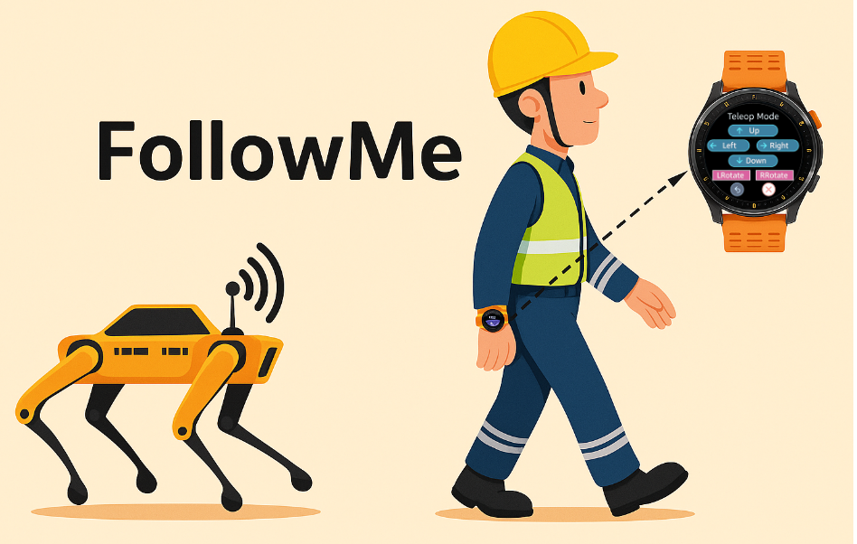
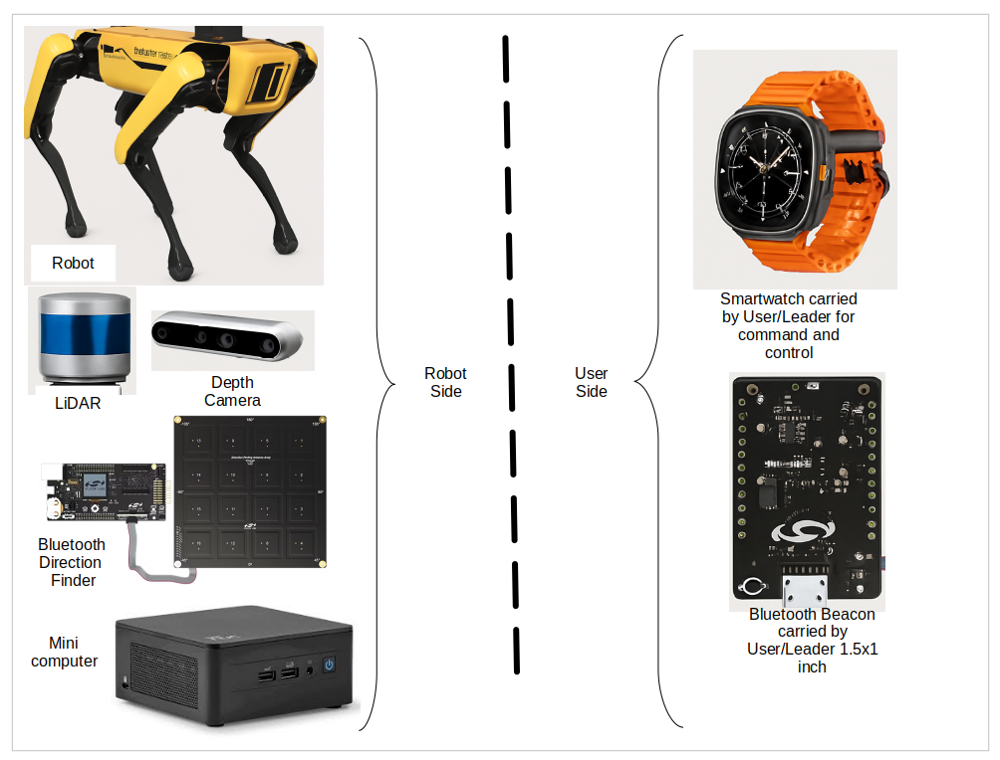
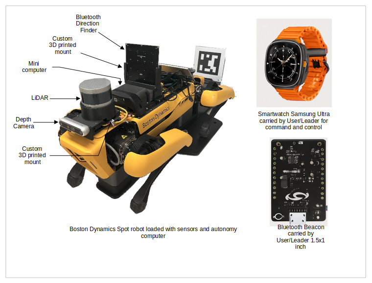

# FollowMe Project



The list of hardware used for this project.

The final look after integrating the sensors on to the robot.

Computer vision follow-me online acquiring and tracking target.

Computer vision based robot follower testing with distractor.

Teleop and follow-me.


## Overview

The **FollowMe** project aims to design and implement an intelligent robot follower system leveraging wearable technology and sensor fusion techniques. Robotic systems are often employed to perform tasks that are dangerous, dirty, or dull (commonly known as the 3Ds). However, repeated manual control of robots can become monotonous and mentally exhausting, often leading to human error and reduced efficiency.

## Features

- Intelligent following behavior using real-time sensor data
- Wearable technology for seamless human-robot interaction
- Sensor fusion techniques to improve tracking accuracy
- Modular and extensible system architecture

## Technologies Used

- Python / C++ (depending on your codebase)
- ROS (Robot Operating System)
- IMU, GPS, Bluetooth, and camera depth sensor modules
- OpenCV for image processing
- Bluetooth / Wi-Fi communication protocols
- Catkin tools
- Android Studio
- Simplicity Studio

## Hardware

The FollowMe system utilizes a range of modern hardware to ensure accurate tracking, robust communication, and reliable robot control:

- **BG22-PK6022A** – BG22 Bluetooth Dual Polarized Antenna Array Pro Kit
- **EFR32BG22 Thunderboard Kit** – A compact development board for Bluetooth LE applications
- **Samsung Smartwatch Ultra** – For wearable motion tracking and control
- **Boston Dynamics Robot** – As the primary mobile robot platform
- **Intel mini PC** – Computer for autonomy and follower
- **RealSense Depth Camera D455** – For real-time depth sensing and environmental perception
- **Any robot compatible with command velocity (`/cmd_vel`)** – Supporting general-purpose mobile robot control

## Dependencies

- Ubuntu 20.04
- ROS Noetic
- catkin tools
- Android Studio (for installing the app on the smartwatch)

## Installation

1. Connect the smartwatch and the computer running the follower code to the same network. We used a hotspot to connect both to the same subnet, and ensured both devices could ping each other.
2. For the Bluetooth follower, see: [docs](bt_follow_me/README.md)
3. For the Computer Vision follower, follow the instructions here: [docs](cv_follow_me/README.md)
4. For app installation on the smartwatch, follow this link: [docs](user_interface/smartwatch_app/README.md)
5. For the `app_interface_bridge`, see: [docs](app_interface_bridge/README.md)
6. Set up any necessary hardware connections (camera, Bluetooth, etc.)
7. Clone the repository:
   ```bash
   git clone https://github.com/your-username/followme.git
   cd followme
   catkin build
   ```

## Running in Separate Terminals

Open **4 terminals** and run the following commands in each:

```bash
# Terminal 1: Subscribes to the human position so the robot can follow
source devel/setup.bash
roslaunch follow_me_engine follower.launch
```

```bash
# Terminal 2: Publishes the human position using computer vision
source devel/setup.bash
roslaunch cv_follow_me cv_follow_me.launch
```

```bash
# Terminal 3: Publishes the human position using Bluetooth
source devel/setup.bash
roslaunch bt_follow_me cv_follow_me.launch
```

```bash
# Terminal 4: Sends commands from the smartwatch via HTTP POST to ROS services/actions
source devel/setup.bash
rosrun app_interface_bridge app_server
```

### Results

- Open the smartwatch app and press the **Claim** and **Power On** buttons.
- Press the `-->` button to start sending commands to the robot.
- You can now send **Sit** and **Stand** commands, or press the **Teleop** button to control robot motion.
- Press the `<--` back button to return to the previous window.
- Press the **Follow** button, then the **Camera Follower** button to start robot following using vision.
  - Press **Acquisition** and ensure only you are in front of the RealSense camera for about 10 seconds to extract your features.
  - Once completed, press **CV Follow** to begin following behavior.
- At any time, press the **X** button to emergency stop the robot and take manual control.

## Troubleshooting

- Ensure your wearable device is connected and broadcasting data.


## Software Disclaimer

Software Disclaimer

"This command-and-control smartwatch app was developed as part of a class project at the University of California, San Diego (UCSD) involving a collaboration between UCSD students and a United States Government (Government) employee. The Government assumes no responsibility whatsoever for this software's use by other parties, and the software is provided "AS IS" without warranty or guarantee of any kind, express or implied, including, but not limited to, the warranties of merchantability, fitness for a particular purpose, and noninfringement. In no event shall the Government be liable for any claim, damages or other liability, whether in an action of contract, tort or other dealings in the software.  The Government has no obligation hereunder to provide maintenance, support, updates, enhancements, or modifications."

---

For any inquiries or support, please contact:
jraheema@ucsd.edu
